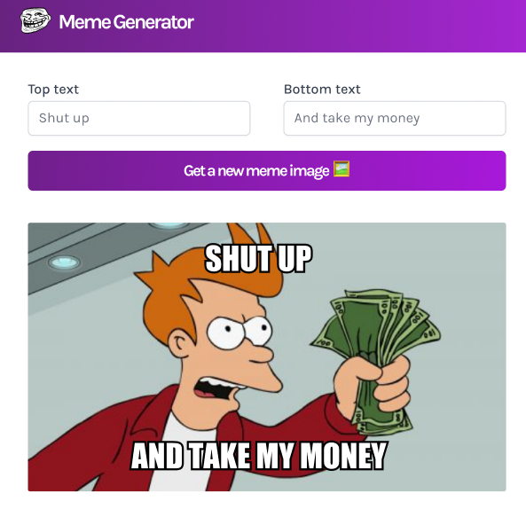
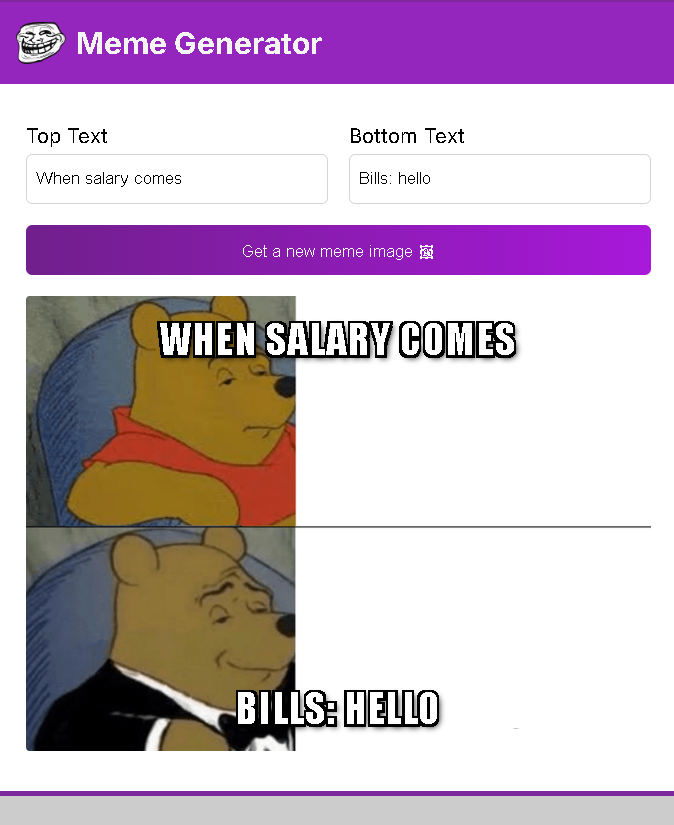
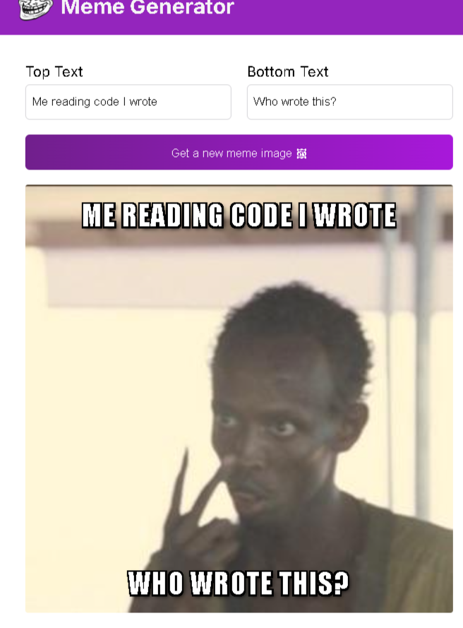
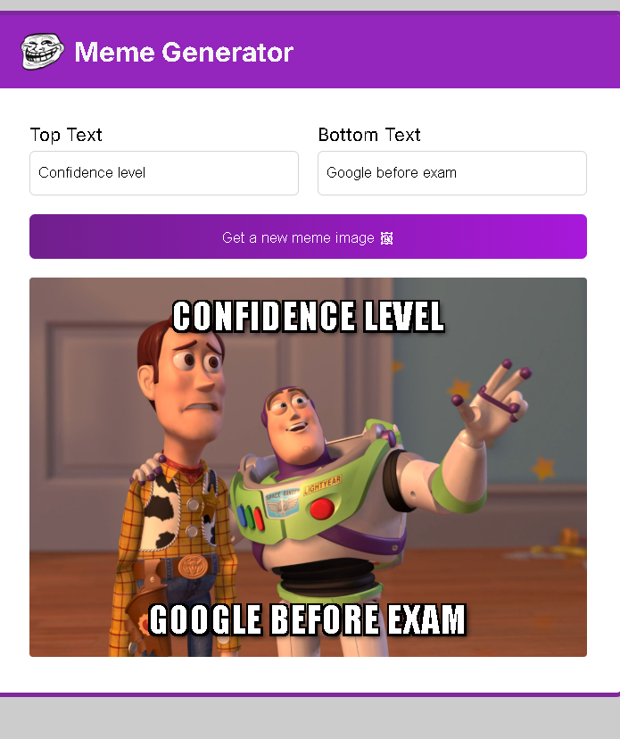
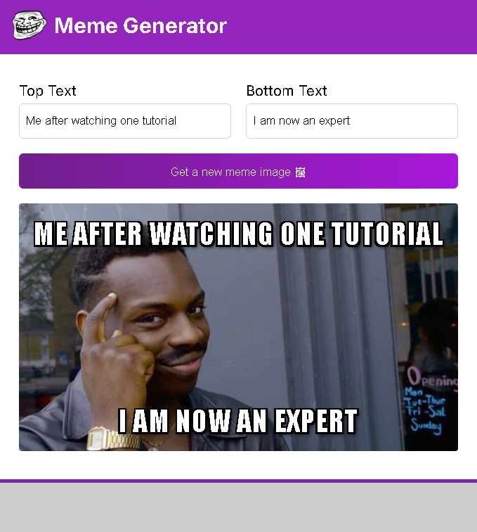
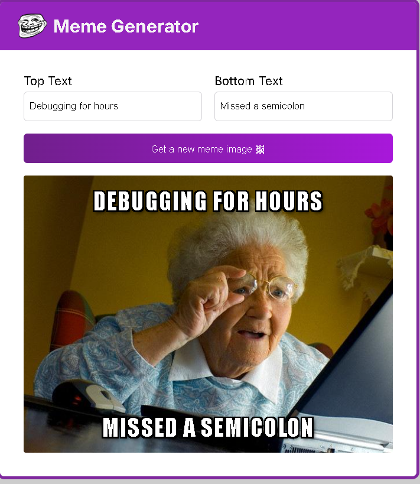
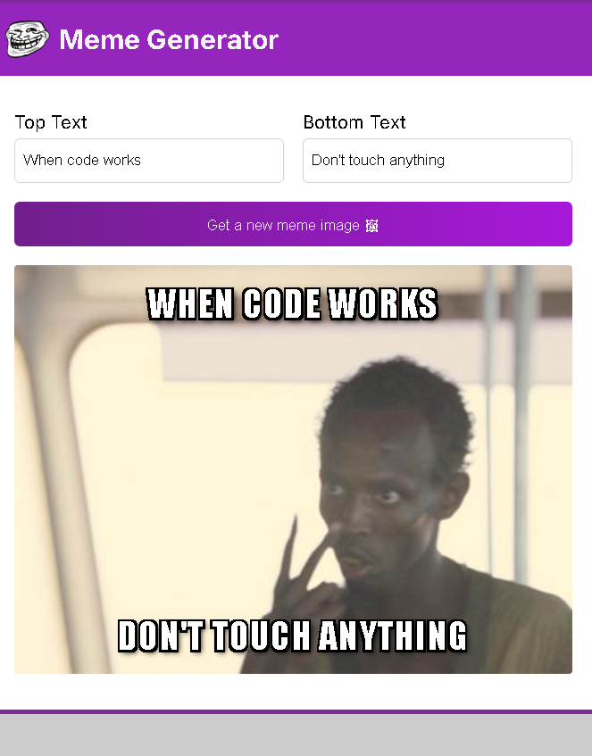
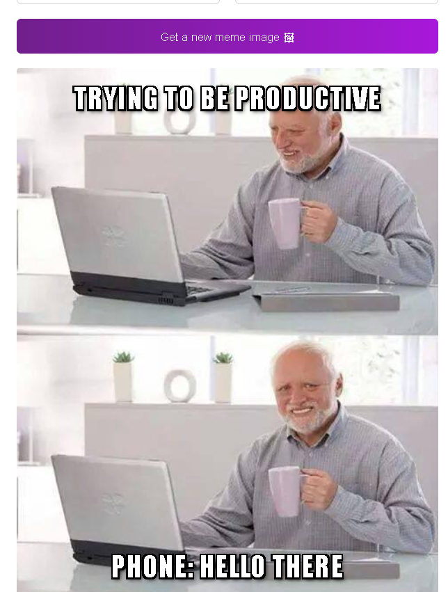

# 🎭 Meme Generator (React + useEffect)

A fun and interactive **Meme Generator** built with **React** that allows users to generate random meme images and create custom captions.

---

## 🚀 Features

* 🎲 Generate random meme images from an API
* ✍️ Add custom top & bottom text
* 😂 Built-in funny paired captions
* ⚡ Uses React Hooks (`useState`, `useEffect`)
* 🎨 Clean and responsive UI

---

## 📸 Screenshots











---

## 🛠️ Tech Stack

* ⚛️ React (Vite)
* 🎯 JavaScript (ES6+)
* 🎨 CSS
* 🌐 Imgflip Meme API

---

## 📂 Project Structure

```
meme-generator-useeffects-sideeffects/
│
├── meme-generator/
│   ├── public/
│   ├── src/
│   │   ├── components/
│   │   │   ├── Header.jsx
│   │   │   └── Main.jsx
│   │   ├── UI/
│   │   │   ├── header.css
│   │   │   └── main.css
│   │   ├── App.jsx
│   │   ├── index.jsx
│   │   └── index.css
│   │
│   ├── package.json
│   └── vite.config.js
│
├── screenshots/
├── screen-recording/
├── README.md
└── .gitignore
```

---

## ⚙️ Installation & Setup

### 1. Clone the repository

git clone https://github.com/ThisisAlam/meme-generator-useeffects-sideeffects.git

### 2. Navigate into project folder

cd meme-generator

### 3. Install dependencies

npm install

### 4. Run development server

npm run dev

---

## 🧠 What I Learned

* Using React Hooks (`useState`, `useEffect`)
* Fetching data from an external API
* Managing dynamic state updates
* Building interactive UI components

---

## 💡 Future Improvements

* 📥 Download meme as image
* 🎭 Add meme categories
* 📱 Improve mobile responsiveness
* 💾 Save favorite memes

---

## 📬 Connect with Me

* 💼 LinkedIn: https://www.linkedin.com/in/fakhar-e-alam-a046133b4/
* 💻 GitHub: https://github.com/ThisisAlam

---

## 🎓 Learn Full Stack Development

If you want to become a **Full Stack Developer**, I highly recommend learning from Scrimba:

👉 https://scrimba.com/?via=u43a7734

They offer an amazing **interactive learning experience** to help you become a **job-ready full stack engineer**.

---

## ⭐ Support

If you like this project, give it a ⭐ on GitHub!
